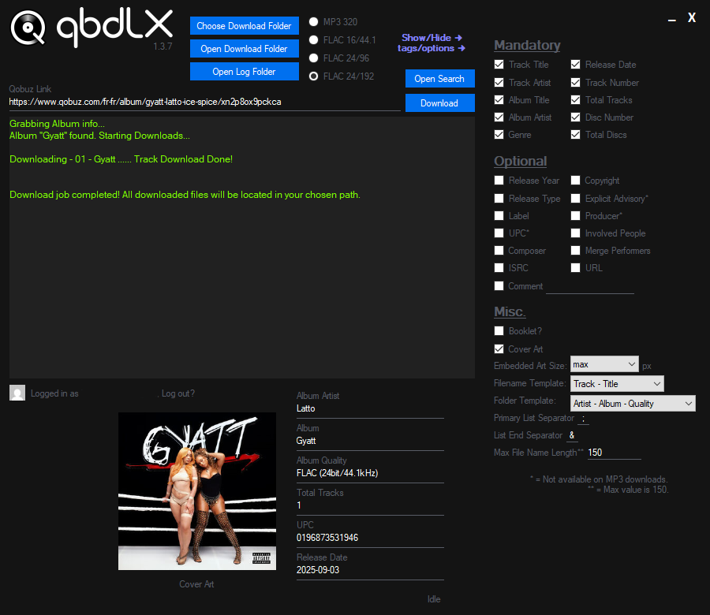

-----

# About

qbdLX is a program for downloading music streams from the streaming platform [Qobuz](https://qobuz.com).

You can only download 30 second previews with a free account, a Studio (Family) account is needed to download full content.

This is a modified version of QobuzDownloaderX-MOD by DJDoubleD. [https://github.com/DJDoubleD/QobuzDownloaderX-MOD]

# Disclaimer & Legal

I will not be responsible for how you use qbdLX.

This program ***DOES NOT*** include...

- Code to bypass Qobuz's region restrictions.
- Qobuz app IDs or secrets.

qbdLX does not publish any of Qobuz's private secrets or app IDs.

It contains regular expressions and other code to dynamically grab them from Qobuz's web player's *publicly available* JavaScript,  which is not rehosted, but grabbed client side.

Scraping public data is not a violation of the Computer Fraud and Abuse Act (USA) according to the Ninth Court of Appeals,  
[case # 17-16783](http://cdn.ca9.uscourts.gov/datastore/opinions/2019/09/09/17-16783.pdf) (see page 29).

qbdLX uses the Qobuz API, but is not endorsed, certified or otherwise approved in any way by Qobuz.

Qobuz brand and name is the registered trademark of it's respective owner.

qbdLX has no partnership, sponsorship or endorsement with Qobuz.

By using qbdLX, you agree to the following: <http://static.qobuz.com/apps/api/QobuzAPI-TermsofUse.pdf>